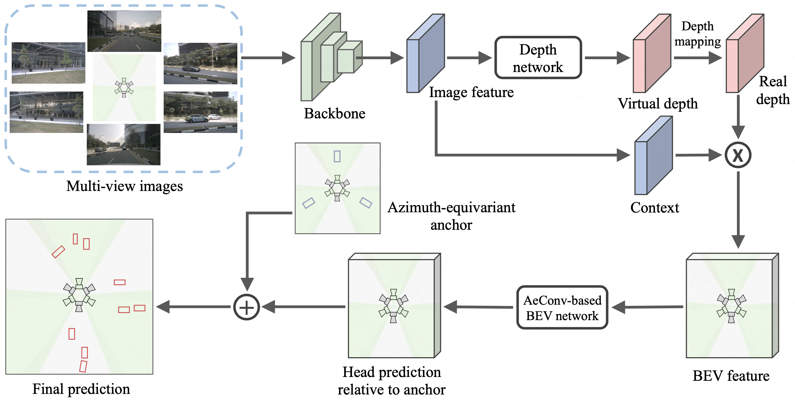

# AeDet: Azimuth-invariant Multi-view 3D Object Detection 
[Paper]() &nbsp; &nbsp; [Website](https://fcjian.github.io/aedet)

## News
AeDet achieves SOTA on Camera-Only nuScenes Detection Task with 53.1% mAP and 62.0% NDS!

## Introduction
Recent LSS-based multi-view 3D object detection has made tremendous progress, by processing the features in Brid-Eye-View (BEV) via the convolutional detector. However, the typical convolution ignores the radial symmetry of the BEV features and increases the difficulty of the detector optimization. To preserve the inherent property of the BEV features and ease the optimization, we propose an azimuth-equivariant convolution (AeConv) and an azimuth-equivariant anchor. The sampling grid of AeConv is always in the radial direction, thus it can learn azimuth-invariant BEV features. The proposed anchor enables the detection head to learn predicting azimuth-irrelevant targets. In addition, we introduce a camera-decoupled virtual depth to unify the depth prediction for the images with different camera intrinsic parameters. The resultant detector is dubbed Azimuth-equivariant Detector (AeDet). Extensive experiments are conducted on nuScenes, and AeDet achieves a 62.0% NDS, surpassing the recent multi-view 3D object detectors such as PETRv2 (58.2% NDS) and BEVDepth (60.0% NDS) by a large margin.

### Method overview



## Prerequisites
Code will be released soon.

## Results
### 3D Object Detection on nuScenes val set:
Model | Image size | CBGS | mAP | NDS
--- |:---:|:---:|:---:|:---:
AeDet_R50        | 256x704  | No  | 0.358 | 0.473
AeDet_R50        | 256x704  | Yes | 0.387 | 0.501 
AeDet_R101       | 512x1408 | Yes | 0.449 | 0.561

### 3D Object Detection on nuScenes test set:
Model | Image size | CBGS | mAP | NDS
--- |:---:|:---:|:---:|:---:
AeDet_ConvNeXt-B | 640x1600 | Yes | 0.531 | 0.620

## Citation

If you find AeDet useful in your research, please consider citing:

```
@inproceedings{feng2022aedet,
    title={AeDet: Azimuth-invariant Multi-view 3D Object Detection},
    author={Feng, Chengjian and Jie, Zequn, Zhong, Yujie and Chu, Xiangxiang and Ma, Lin},
    journal={arXiv preprint},
    year={2022}
}
```
