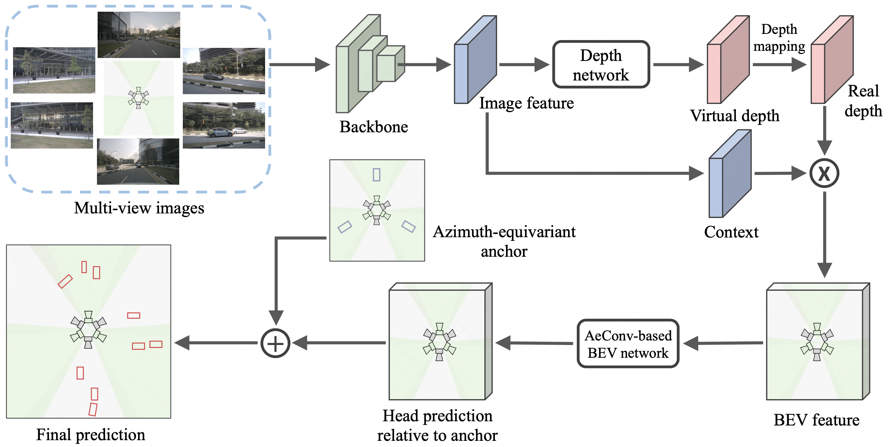

# AeDet: Azimuth-invariant Multi-view 3D Object Detection 
[Paper](https://arxiv.org/abs/2211.12501) &nbsp; &nbsp; [Website](https://fcjian.github.io/aedet)

## News
AeDet achieves SOTA on Camera-Only nuScenes Detection Task with 53.1% mAP and 62.0% NDS!

## Introduction
Recent LSS-based multi-view 3D object detection has made tremendous progress, by processing the features in Brid-Eye-View (BEV) via the convolutional detector. However, the typical convolution ignores the radial symmetry of the BEV features and increases the difficulty of the detector optimization. To preserve the inherent property of the BEV features and ease the optimization, we propose an azimuth-equivariant convolution (AeConv) and an azimuth-equivariant anchor. The sampling grid of AeConv is always in the radial direction, thus it can learn azimuth-invariant BEV features. The proposed anchor enables the detection head to learn predicting azimuth-irrelevant targets. In addition, we introduce a camera-decoupled virtual depth to unify the depth prediction for the images with different camera intrinsic parameters. The resultant detector is dubbed Azimuth-equivariant Detector (AeDet). Extensive experiments are conducted on nuScenes, and AeDet achieves a 62.0% NDS, surpassing the recent multi-view 3D object detectors such as PETRv2 and BEVDepth by a large margin.

### Method overview



## Quick Start
### Installation
**Step 0.** Install [Pytorch](https://pytorch.org/) (v1.9.0).

**Step 1.** Install [MMDetection3D](https://github.com/open-mmlab/mmdetection3d) (v1.0.0rc4).
```shell
# install mmcv
pip install mmcv-full

# install mmdetection
pip install git+https://github.com/open-mmlab/mmdetection.git

# install mmsegmentation
pip install git+https://github.com/open-mmlab/mmsegmentation.git

# install mmdetection3d
cd AeDet/mmdetection3d
pip install -v -e .
```
**Step 2.** Install requirements.
```shell
pip install -r requirements.txt
```
**Step 3.** Install AeDet (gpu required).
```shell
python setup.py develop
```

### Data preparation
**Step 0.** Download nuScenes official dataset.

**Step 1.** Symlink the dataset root to `./data/`.
```
ln -s [nuscenes root] ./data/
```
The directory will be as follows.
```
AeDet
├── data
│   ├── nuScenes
│   │   ├── maps
│   │   ├── samples
│   │   ├── sweeps
│   │   ├── v1.0-test
|   |   ├── v1.0-trainval
```
**Step 2.** Prepare infos.
```
python scripts/gen_info.py
```
**Step 3.** Prepare depth gt.
```
python scripts/gen_depth_gt.py
```

### Tutorials
**Train.**
```
python ${EXP_PATH} --amp_backend native -b 8 --gpus 8 [--ckpt_path ${ORIGIN_CKPT_PATH}]
```
**Eval.**
```
python ${EXP_PATH} --ckpt_path ${EMA_CKPT_PATH} -e -b 8 --gpus 8
```

## Results
### 3D Object Detection on nuScenes val set:
Model | Image size | #Key frames | CBGS |  mAP  |  NDS   |  Download
--- |:-----------:|:-----------:|:---:|:-----:|:------:|:---:
[BEVDepth_R50 (Baseline)](https://github.com/Megvii-BaseDetection/BEVDepth) | 256x704  |     One     |     No     | 0.315 | 0.367  |  --
[BEVDepth_R50_2KEY (Baseline)](https://github.com/Megvii-BaseDetection/BEVDepth) | 256x704  |     Two     |     No     | 0.330 | 0.442  |  --
[AeDet_R50](exps/aedet/aedet_lss_r50_256x704_128x128_24e.py)   | 256x704  |     One     |     No     | 0.334 | 0.401  |  [google](https://drive.google.com/file/d/1S-NcWXs-7kTsw1qIZooGLMFw-LSBj93i/view?usp=sharing)
[AeDet_R50_2KEY](exps/aedet/aedet_lss_r50_256x704_128x128_24e_2key.py)   | 256x704  |     Two     |     No     | 0.359 | 0.473  |  [google](https://drive.google.com/file/d/1mExxghQJLCDiuZmYhmpozW7iv0ixmrzj/view?usp=sharing)
[AeDet_R50_2KEY_CBGS](exps/aedet/aedet_lss_r50_256x704_128x128_20e_cbgs_2key.py)        | 256x704  |     Two     |    Yes     | 0.381 | 0.502  |  [google](https://drive.google.com/file/d/19r3kCHGng3rBEHsgAskCXduKnB4Yu3Fq/view?usp=sharing)

## Acknowledgement

Thanks [BEVDepth](https://github.com/Megvii-BaseDetection/BEVDepth) team and [MMDetection3D](https://github.com/open-mmlab/mmdetection3d) team for the wonderful open source project!

## Citation

If you find AeDet useful in your research, please consider citing:

```
@inproceedings{feng2023aedet,
    title={AeDet: Azimuth-invariant Multi-view 3D Object Detection},
    author={Feng, Chengjian and Jie, Zequn and Zhong, Yujie and Chu, Xiangxiang and Ma, Lin},
    booktitle={Proceedings of the IEEE/CVF Computer Vision and Pattern Recognition},
    year={2023}
}
```
